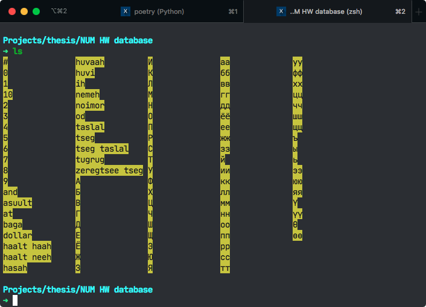
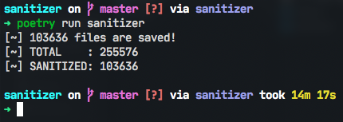
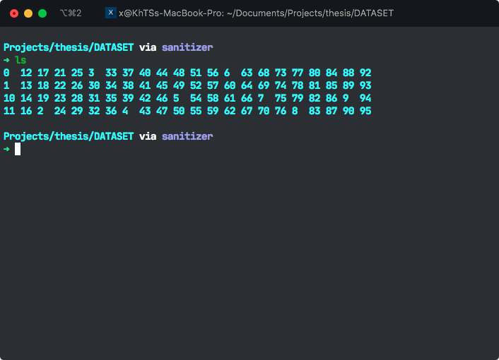

# Sanitizer

Sanitizer is a Python library for dealing with duplicated training data. It utilizes a module that is added in Python 3, called concurrent.futures to minimizes the time that is needed for the general process.

## Usage

What you have to do first is to change `labels.json` and `config.json` files to your needs.

`labels.json` - This contains the input folder names as _key_ and their related _id_, ascii _symbol_ as _value_ in json format.

`config.json` - This holds _symbol_ values from `labels.json` as _key_ and result folder name as _value_ in json format.

```bash
poetry run sanitizer
```

## Screenshots





## Contributing

Pull requests are welcome. For major changes, please open an issue first to discuss what you would like to change.

Please make sure to update tests as appropriate.

## License

[MIT](https://choosealicense.com/licenses/mit/)
