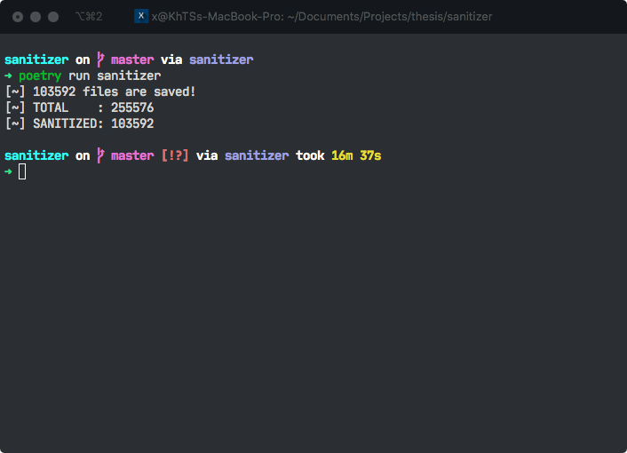

# Sanitizer

Sanitizer is a Python library for dealing with duplicated training data. It utilizes a module that is added in Python 3, called concurrent.futures to minimizes the time that is needed for the general process.

## Usage

```bash
poetry run sanitizer
```

## Result



## Contributing

Pull requests are welcome. For major changes, please open an issue first to discuss what you would like to change.

Please make sure to update tests as appropriate.

## License

[MIT](https://choosealicense.com/licenses/mit/)
